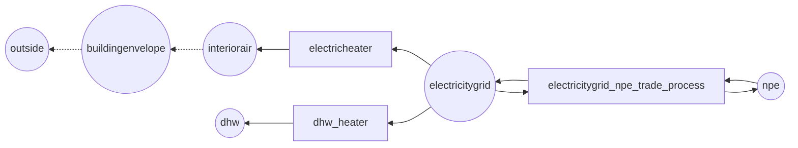
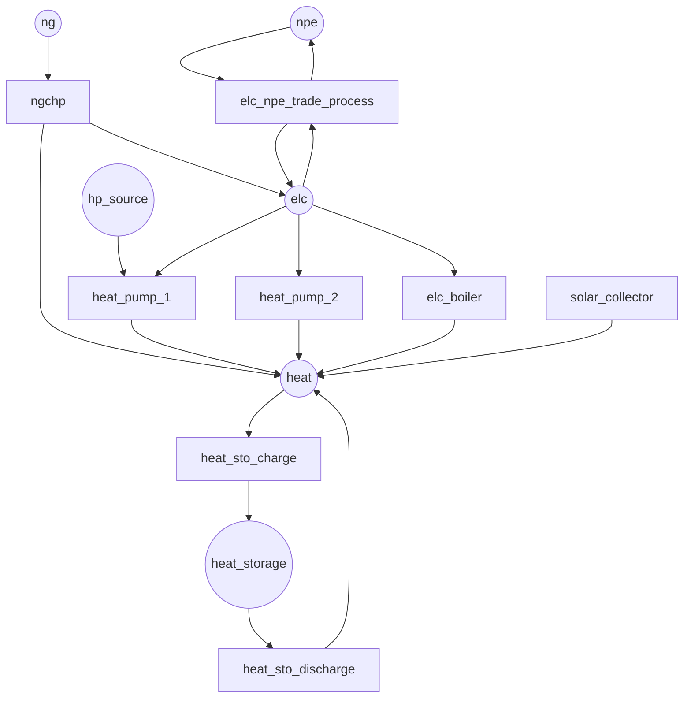

# Example models in detail

## Introduction

This section contains a more detailed description of example models found in Predicer. The idea behind the example models is not to provide a detailed and correct ready-to-use model, but rather to explain concepts and ideas found in Predicer. These concepts and ideas can then be used to build more complex models replicating real systems. It is recommended that this section is read while having the respective example model input data file for reference.

## Simple building model

The input data file for the model can be found under *"/Predicer/input_data/simple_building_model.xlsx"*. The simple building model is a model of a simplified building with direct electric heating with spot-based electricity pricing. The energy balance of the modelled building consists of three major elements; heat loss from inside the building to the ambient air, and an electric heater to maintain the temperature of the inside air within a comfortable range. In addition an electric powered domestic hot water (DHW) tank is modelled as a storage, with the use of DHW being represented by a timeseries. The aim of the model is to minimize the electricity costs for the electric heater and the DHW heater by using the storage capacities of the building and the DHW tank to time the use of electricity to the cheapest hours. This should be done while maintaining the temperature of the building at a comfortable level and ensuring that the hot water tank doesn't empty at any point during the day.

A real building could of course be modelled more accurately, adding concepts such as heat losses through ventilation, overall electricity use, effect of solar radiation, dividing the building into smaller nodes, etc. 

The model horizon for the simple building model is 9.0 hours with the timesteps being 15 minutes, for a total of 36 timesteps. There are three scenarios in the model (*s1*, *s2* and *s3*), and all of the data used in the model is randomly generated. 

### Nodes and processes
The model consists of five nodes: *interiorair* representing the air (and structures) inside the building, *buildingenvelope* representing the building components separating the inside from the outside, *outsideair* representing the ambient air, *dhw* representing the domestic hot water tank, and *elc* representing the local electricity grid the building is connected to. *npe* represents the electricity market from where electricity can be bought for a hourly varying price.

There are two processes in the model: *electricheater* for converting electricity from the *elc* node to heat in the *interiorair* node, and *dhw_heater* converting electricity from the *elc* node to heat in the *dhw* node. Below is a simple schematic of the topology of the simple building model. 

### Modelling building heat loss

The building heat loss is modelled as transfer of heat through the *buildingenvelope*, driven by the temperature difference between the *interiorair* and the *outsideair* nodes. The heat loss to the ambient air is modelled using the diffusion functionality found in Predicer. A diffusion flow can be defined between two nodes with states, with the states generally being modelled as temperature instead of energy.  The size of the flow between two nodes in a diffusion relation is simply the difference between the states multiplied with a user-defined coefficient ***c***. 

***Ploss = c * (state1 - state2)***

The unit of the heat transfer coefficient ***c*** in this model case would be *kW/K*. The value of the diffusion coefficient is chosen to be 0.25 *(kW/K)* between the *interiorair* and *buildingenvelope* nodes and 0.2 *(kW/K)* between the *buildingenvelope* and *outside* nodes. In the example Excel file, this is done on the *node_diffusion* sheet.

| node1	           | node2	          | diff_coeff |
|------------------|------------------|------------|
| interiorair      | buildingenvelope | 0.25       |
| buildingenvelope | outside          | 0.2        |

To be able to model heat loss, the *buildingenvelope*, *interiorair* and *outside* nodes are given states which represent the temperature in the respective nodes. This is done by setting the *is_state* and *is_temp* flags to **True**. 

Most of the flows in Predicer, such as process flows, diffusion flows, etc. are modelled as *energy*, not *temperature*. The conversion between energy and temperature for a state is defined in the *T_E_conversion* parameter. This parameter indicates how much energy is required to increase the temperature of the state by one (the unit depends on the model, in this case one Kelvin *K*). In the simple building model the energy is in the form of *kW/kWh*, and temperature in the form of *K*. The conversion rate is set to 0.5 *(kWh/K)* for the *interiorair* node and 1.0 *(kWh/K)* for the *buildingenvelope* node. If the heat losses were zero, this would mean that operating the electric heater at 1 kW for one hour would increase the temperature of the *interiorair* node by 2 K, which essentially would mean increasing the value of the storage (state) by 2. As the heat losses from the building are not expected to increase the temperature of the ambient air, the *T_E_conversion* parameter is set to 1 000 000 000 for the *outside* node. In the simple building model this means, that a cumulative heat flow of 109 kWh into the ambient air node is required to increase its storage state by 1 (*K*).

The initial states of the *interiorair*, *buildingenvelope* and *outside* nodes are set to 292.15 K,
282.0 K and 269.5 K, respectively. The modelled system is approximately in balance on the first timestep when these values are used. 

As the heat loss in this model depends on the temperature difference between the building and the ambient air, it is important to be able to define the ambient air temperature properly. This can be done by setting the *is_inflow* flag of the *outside* node to **True**. This allows the hourly temperature changes of the ambient air to be given as an inflow timeseries to the node. So if the initial ambient temperature would be 263K, and the temperature for three first time steps would be 273K, 268K and 260K, the inflow timeseries to the ambient air node (*outside*) would be [+10, -5, -8] for the first three timesteps.

As one of the objectives of this example model is to maintain a comfortable temperature inside the building, the boundaries of the comfortable temperature range must be defined. This can either be done using hard or soft boundaries. If hard boundaries are used, the temperature of the *interiorair* node is not allowed to go below or above the boundaries. This can be achieved either by setting the node parameters *state_min* and *state_max* to the desired temperature range, or by making user-defined gen_constraints with the *is_setpoint* flag set to false. 

Soft boundaries for the temperature range can be defined by making user-defined gen_constraints with the *is_setpoint* flag set to true. When a suitable cost (*penalty* parameter in the "constraints" sheet in the input data excel file) is set, the model can deviate from the given temperatue range, but this induces a cost for the model and is thus usually avoided. It is also possible to combine several layers of soft boundaries, with the cost of deviation increasing for each passed layer, and hard boundaries with soft boundaries, as long as the hard boundaries are less "strict" than the soft boundaries (e.g. hard boundary lower/upper limits of 15°C/27°C and soft boundery lower/upper limits of 19°C/24°C).

| name               | operator | is_setpoint | penalty |
|--------------------|----------|-------------|---------|
| c_interiorair_up   | st       | 1           | 15      |
| c_interiorair_down | gt       | 1           | 15      |

One set of soft boundaries are used in the example model, defined using the "c_interiorair_up" as upper limit and "c_interiorair_down" as lower limit gen_constraints. The operator for the constraints are "st" (smaller than) and "gt" (greater than), meaning that the value of the limited variable should be smaller than and greater than, respectively, than the value of the constraints. The parameter *is_setpoint* is set to true as this is a setpoint constraint, with the *penalty* parameter being set to 15 *(€/K/h)*. The penalty is not a real cost, but rather a steering cost for getting the model to behave in an intended manner. The other part of the constraints are defined in the "gen_constraint" sheet in the input data excel. The limiting value for *c_interiorair_up* is set to 298.15K (25°C), and the limit for *c_interiorair_down* is 292.15K (19°C). 

| t                   | c_interiorair_up,interiorair,s1 | c_interiorair_down,interiorair,s1 |
|---------------------|---------------------------------|-----------------------------------|
| 2022-01-05T08:00:00 | 298,15                          | 292,15                            |
| 2022-01-05T08:15:00 | 298,15                          | 292,15                            |
| ...                 | ...                             | ...                               |

The *state_min* and *state_max* parameters for the *interiorair*, *buildingenvelope* and *outside* nodes are set to values that are outside the the system is expected to reach. As the inside temperature range is between 292K-298K, a suitable range for the *interiorair* state is 273K to 308K. For the *outside* and *buildingenvelope* nodes a minimum and maximum values for the states are chosen to be 238K and 308K. 

### Modelling the domestic hot water system

The idea behind modelling the DHW system is to use the DHW tank as a storage, to time the use of electricity to prepare the hot water to the time when the price of electricity is the lowest. This has to be done, while ensuring that the DHW never runs out. The storage is allowed to be empty momentarily, as long as there is enough to cover the demand at all times. 

The DHW system is modelled using a node *dhw* with a state (storage) and inflow (hot water use timeseries). The unit in *dhw* is thought to be *kWh*, to make it easier to model in this case. This means that the "water" in the DHW tank is represented by the amount of energy it would require to heat it from cold water, and the limits of the storage, as well as the inflow (use) of DHW uses this same unit. The storage losses of the DHW tank are not accounted for, as it is assumed that the heat is dissipated into the building, thus reducing the need to operate the electric space heater. The *state_loss-proportional* parameter is thus set to 0. 

The inflow data for the DHW system is randomly generated, with a small baseload and one or more larger spikes, representing 5-15 minute showers. The DHW demand can either be covered directly using the *dhw* heater, or by taking water from the hot water tank. The DHW demand is between 15 - 22 kWh over the modelled 9 hours, with the largest peak being 9.17 kWh over an timestep. This means that the *dhw_heater* (3 kW) is not enough to cover the demand at all timesteps. 

As Predicer doesn't consider what happens before or after the modelled time horizon, it is likely that the DHW tank would be empty after the last timestep, since any water left in the tank would be "wasted" from the perspective of the model. To amend this, a value for the water remaining in the tank can be defined. This value estimate is set to be the average hourly electricity price of the simple building model. This parameter is defined using the *state_residual_value* field in the input_data file on the *nodes* sheet.

## Simple district heating system model

The input data file for the model can be found under *"/Predicer/input_data/simple_dh_model.xlsx"*. The simple district heating model is a model of a simple district heating system, operated by a single actor. The idea behind the system is to minimize the costs (or maximize the profits) while covering an hourly heat demand, and operating on an electricity spot market. The heat demand is defined as a time series, and the system has to cover the demand at all times. Several different heat generation units in combination with a heat day storage provides flexibility, which can be utilized to minimize the costs of covering the demand. The price of the provided heat is not defined (also 0), as is usual for local DH system modelling. The costs of the modelled system thus consist of fuel and operational costs for generating the required heat, and profits come from electricity sold to the spot market.

The model only considers heat balances on a system production level, and building-specific balances are not considered. DH pressures, temperatures, losses, etc. are also not considered in the model. The modelled system is fictional, and the data used in the model is either fictional and/or randomly generated.

### Nodes and processes

The modelled system consists of five nodes: *ng* representing a natural gas grid from where natural gas can be bought for a fixed price, *elc* representing a local electricity grid, *heat* representing a district heating grid, *hp_source* representing a natural heat source, such as seawater, and *npe* representing an electricity spot market where electticity can be bopught and sold for an hourly price. Additionally the node *heat_storage* represents a thermal energy storage connected to the district heating system. 

There are several process for generating heat in the system; *elc_boiler* converting electricity directly to heat, *heat_pump_1* converting electricity and low-temperature heat from the *hp_source* node to heat in the *heat* node with a variable capacity, *heat_pump_2* converting electricity to heat in the *heat* node with a variable efficiency, *solar_collector* producing heat based on a capacity factor time series, and *ngchp* representing a combined heat and power plant converting natural gas from the *ng* node to electricity and heat at a fixed ratio. Additionally, there is a process *heat_sto_charge* for transferring heat from the *heat* node to the *heat_storage* and *heat_sto_discharge* for transferring heat from the *heat_storage* to the *heat* node. The process *elc_npe_trade_process* is used to buy and sell electricity from the electricity spot market *npe*. 

Below is a simple flowchart of the modelled system, showing the connections between the nodes and processes in the modelled system. 

In the model there are various costs linked to power and heat generation which should be taken into consideration. These costs include fuel costs (natural gas, electricity), electricity transmission costs, carbon emission permits, as well as emission taxes for carbon and electricity. The fuel cost of natural gas is defined as a timeseries on the *price* sheet in the input data, with a value of 80.0 (*€/MWh*) for every hour. The cost of electricity, both when buying and selling is defined as a timeseries in the *market_prices* sheet in the input data. The prices are randomly generated, and vary between 2.13-85.38 (*€/MWh*), with an average price of 42.92 (*€/MWh*). 

The sum of the carbon emission permits and carbon tax amount to 22.0 (*€*) per MWh of natural gas used. As these costs depend on the use of natural gas from the *ng* node, the VOM (variable operation and maintenance) cost of the natural gas flow for the *ngchp* process in the *process_topologies* sheet is set to 22.0. This causes a cost of 22.0 for each unit (*MWh*) of *ng* that is used by the *ngchp* process. In this example model case these costs could also have been directly added to the price of natural gas, as the *ngchp* process is the sole consumer of natural gas. Another way to implement carbon permits or taxes (*€/ton*) would be to add a "emissions" flow to relevant processes and to add the costs to the VOM of this flow. To ensure this works properly, a *gen_constraint* has to be created to fix the size of the emission flow proportional to the size of the natural gas flow into the process. Additionally, the efficiency of the process has to be adjusted to include the emissions. A third way would be to create a commodity node *carbon_permits_and_taxes*, from where there would be a flow to a process using natural gas. In this case a *gen_constraint* fixing the ratio between natural gas and "emissions" would be needed as well. The emission costs can be set as the price of the commodity node. 

The sum of electricity tax and distribution costs is assumed to be 15.0 (*€/MWh*), and is added to each topology where electricity is consumed, except when buying from the market node. In this model this means the *elc* flows of the heat pumps and the *elc* flow of the *elc_boiler*. A summary of the relevant production costs for processes and flows is visualized in the table below. 

| Process flow                     | Fuel costs   | Taxes + Carbon permits |
|----------------------------------|--------------|------------------------|
| ngchp, ng                        | 80.0         | 22.0                   |
| ngchp, elc                       | 0.0          | 0.0                    |
| ngchp, heat                      | 0.0          | 0.0                    |
| heat_pump_1, elc                 | 2.13 - 85.38 | 15.0                   |
| heat_pump_1, hp_source           | 0.0          | 0.0                    |
| heat_pump_1, heat                | 0.0          | 0.0                    |
| heat_pump_2, elc                 | 2.13 - 85.38 | 15.0                   |
| heat_pump_2, heat                | 0.0          | 0.0                    |
| heat_sto_charge, heat            | 0.0          | 0.0                    |
| heat_sto_charge, heat_storage    | 0.0          | 0.0                    |
| heat_sto_discharge, heat_storage | 0.0          | 0.0                    |
| heat_sto_discharge, heat         | 0.0          | 0.0                    |
| solar_collector, heat            | 0.0          | 0.0                    |
| elc_boiler, elc                  | 2.13 - 85.38 | 15.0                   |
| elc_boiler, heat                 | 0.0          | 0.0                    |

### Modelling the heat pumps

There are two heat pump processes, *heat_pump_1* and *heat_pump_2*, in this example model. Both of these processes convert electricity from the *elc* node to heat in the *heat* node. Additionally *heat_pump_1* is connected to the commodity node *hp_source*, from where lower-grade heat can be obtained from free, but at a limited availability. The coefficient of power (COP) of a heat pump depends on many factors, one of which is the temperature of the used heat source. As the temperature (and thus COP) and availability of some natural heat sources typically fluctuate between seasons or even days, the operational limits of heat pump can be defined using timeseries. In this example there are two heat pumps with similar parameters (capacity, cost, etc). The operation of the heat pumps is affected by the price of electricity, the efficiency, and the amount of heat available from the node *hp_source*. The heat production of *heat_pump_1* is limited by the availability of heat from the *hp_source* node, while the production for the process *heat_pump_2* depends on a timeseries-dependent efficiency.

The amount of heat from the *hp_source* available to the *heat_pump_1* process is limited with a timeseries, setting an upper limit for the flow between the *hp_source* node and the *heat_pump_1* process. This timeseries is defined on the *cap_ts* sheet in the example input data. Below is a part of the table found in the *cap_ts* sheet in the input data file. It is assumed, that the efficiency of *heat_pump_1* is constant at 3.0, meaning 1/3 of the generated heat comes from the electricity, and 2/3 comes from the heat source. A value of 3.13 (MW) for available heat would mean, that the amount of electricity is half (1.565 MW) and the total heat output would be 4.695 MW. 

| t              | heat_pump,hp_source,s1 | heat_pump,hp_source,s2 | heat_pump,hp_source,s3 |
|----------------|------------------------|------------------------|------------------------|
| 16.4.2024 0:00 | 3,13                   | 4,69                   | 4,99                   |
| 16.4.2024 1:00 | 3,23                   | 4,89                   | 5,09                   |
| 16.4.2024 2:00 | 3,23                   | 5,09                   | 4,89                   |
| ...            | ...                    | ...                    | ...                    |

The efficiency timeseries for the *heat_pump_2* process is defined on the *eff_ts* sheet in the input data. The given timeseries limits the total efficiency of the process for every timestep, meaning *flows_in* * *eff* = *flows_out*. The heatpump has one flow in (*elc*) and one flow out (*heat*). Below is a part of the defined data in the *eff_ts* sheet in the input data file. An efficiency of 2.95 would in the case of the *heat_pump_2* process mean that the amount of heat provided to the *heat* node at time ***t*** is 2.95 times the electric power of the heat pump at time ***t***, meaning 1.0 MW of electricity and 1.95 MW of heat (not modelled for *heat_pump_2*) would be required for a heat output of 2.95 MW. 

| t              | heat_pump_2,s1 | heat_pump_2,s2 | heat_pump_2,s3 |
|----------------|----------------|----------------|----------------|
| 16.4.2024 0:00 | 2,95           | 3,1            | 2,75           |
| 16.4.2024 1:00 | 2,83           | 3,04           | 2,64           |
| 16.4.2024 2:00 | 2,93           | 3,14           | 2,57           |
| ...            | ...            | ...            | ...            |

### Modelling the CHP unit

The combined heat and power process *ngchp* converts natural gas from the *ng* node to electricity to the *elc* node and heat to the *heat* node. In reality a natural gas-based CHP plant would consist of a steam boiler, steam turbine, turbine bypass, etc. In this case the whole plant is modelled as a single process with fuel in to the process and electricity and heat out of the process. The heat rate of the process is set to be constant at all loads, with the amount of generated heat being 3 times the amount of generated electricity. The process *ngchp* is modelled with the *ng* flow in and with the *elc* and *heat* flows out. So called user constraints, or in Predicer terms *gen_constraints*, are used to define the heat rate. Without user constraints Predicer would be able to adjust the electric and heat flows freely, as long as efficiency, online and capacity boundaries are fulfilled. 

The user constraints are defined in the *constraint* and *gen_constraint* sheets in the input data file. The name, type and operator of the constraint is defined on the *constraint* sheet. The user constraint *ngchp_c1* has the operator *eq*, meaning "equal", and it is not a setpoint constraint. How the constraint *ngchp_c1* is defined on the *constraint* sheet is shown in the table below. 

| name     | operator | is_setpoint | penalty |
|----------|----------|-------------|---------|
| ngchp_c1 | eq       | 0           | 0       |

User constraints consist of a sum of variables multiplied with coefficients, being set equal to a constant. The names, types and coefficients of the variables limited by the user constraints are defined on on the *gen_constraint* sheet. In this example case the heat flow variable should be set to be three times larger than the electricity flow variable, which can be written as:

*v_flow[heat] = 3 * v_flow[elc]*

Which can be written as

*v_flow[heat] - 3 * v_flow[elc] = 0*

The coefficients for the heat and electricity flow variables should thus be 1 and -3, respecitvely, and the constant should be zero. Below is a part of the *gen_constraints* sheet table, where the variables, coefficients and constant are defined. The types of the variables depends on the column names, and in the case of flow variables is of the form *constraint_name,process,flow,scenario*. As such the column names are *"ngchp_c1,ngchp,elc,s1"* and *"ngchp_c1,ngchp,heat,s1"*. Additionally, the constant value of the constraint is required, and is defined with a column namenotation of *constraint_name,scenario*. As the heat rate is constant, and same in all scenarios, the values must be defined for every timestep in all scenarios. 

| t              | ngchp_c1,ngchp,elc,s1 | ngchp_c1,ngchp,heat,s1 | ngchp_c1,s1 |
|----------------|-----------------------|------------------------|-------------|
| 16.4.2024 0:00 | -3                    | 1                      | 0           |
| 16.4.2024 1:00 | -3                    | 1                      | 0           |
| ...            | ...                   | ...                    | ...         |

In this model the heat rate is set to a constant value, but it would be possible to have a varying heat rate. This could be done by making two user constraints, one defining the lower bound of the electricity-heat ratio, and one defining the upper bound of the ratio. Assuming the heat output should be between 2.5 and 3.5 times the electrical output, the constraint could be formulated as: 

*v_flow[heat] >= 2.5 * v_flow[elc]*

*v_flow[heat] <= 3.5 * v_flow[elc]*

Which can be written as

*v_flow[heat] - 2.5 * v_flow[elc] >= 0*

*v_flow[heat] - 3.5 * v_flow[elc] <= 0*

### Modelling the solar collector

The solar collector process *solar_collector* in this model is modelled as a *capacity factor* (*cf*) process. In contrast to other process types, *cf* processes do not have a source node going into the process. Instead, the process is modelled using a capacity factor timeseries. This means that the process has a maximum output, and a hourly *capacity factor* (***cf***) timeseries defining what percentage of this output can be used. This *cf* timeseries is defined on the *cg* sheet in the input data file.

| t              | solar_collector,s1 | solar_collector,s2 | solar_collector,s3 |
|----------------|--------------------|--------------------|--------------------|
| 16.4.2024 0:00 | 1                  | 0,63               | 0,02               |
| 16.4.2024 1:00 | 0,96               | 0,56               | 0,0                |
| 16.4.2024 2:00 | 0,97               | 0,55               | 0,09               |
| ...            | ...                | ...                | ...                |

The maximum capacity of the solar collector is set to 3.0 (*MW*). The *is_fixed* flag in the *processes* sheet is set to false, meaning that the *cf* timeseries sets an upper limit for the production of the *cf* process. If *is_fixed* would be set to true, then the output of the process would be fixed by the capacity factor timeseries. 

In this example this means, that if the value capacity factor timeseries value for a certain hour would be 1, then the output of the *solar_collector* process would be between 0.0 (*MW*) and 3.0 (*MW*). If the *cf* value would be 0.3, the output would be 0-0.9 (*MW*). 

### Modelling the heat storage

The simple district heating model contains a daily heat storage, which can be used to balance the system and offer flexibility between hours. The storage is defined in the node *heat_storage*, and it is connected to the *heat* node via the processes *heat_sto_charge* and *heat_sto_discharge*. The capacity of the storage is set to 10.0 (*MWh*), with the maximum flows in and out of the storage each being 3.0 (*MW*). As the system heat demand varies between 7-15 (*MW*), the storage alone cannot be used to generate heat into the system. The storage losses are 0.001 of the storage value per hour, and the starting value of the storage is set to 0.0. 

Optimization models commonly empty storages by the end of the model horizon, as any storage content is "wasted" from the model perspective. To prevent this, a value for heat remaining in the storage at the end of the model horizon is defined. The chosen value should represent the expected costs of heat production in the "next" horizon. 

## Common start between scenarios

- State, flow variables should be included
- Maybe 10 timesteps, 3 scenarios, and 3 common timesteps

## Large convenience store

 - Heat pumps
 - Solar panels
 - Cold shelves as storage, building as storage
 - Either DH or local heat source (GSHP?)
 - Solar panels/collectors

## Simple hydropower river system

- Delay between plants?
- Variable time control?

## Electric storage producing reserve

- Solar cells + storage acting on spot + some reserve market. 

## Rolling model

- Rolling model for one year. 

